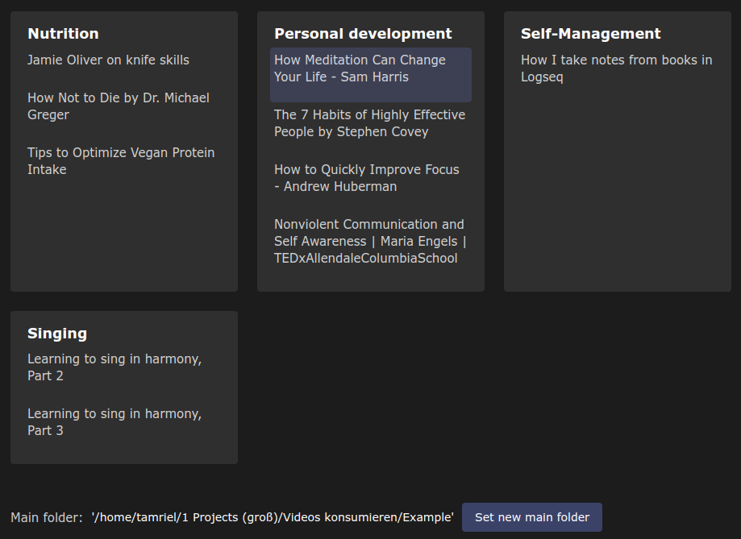

# VideoQueue

A minimal desktop video player that remembers your progress, lets you control playback order and organize videos files into themed folders:



## Features

- Choose a folder with video files once — all videos within that folder and its subfolders will be displayed on startup.
- Double-click a video to play it.
- When viewing, your current playback position is automatically saved, so you can pick up right where you left off.
- Custom Playlist Order:

  - Select a video with a single click.
  - Use Ctrl + ↑ / ↓ to move it up or down in the playback order within its folder.
  - If it's the first or last video in the folder, it can be moved to the end or beginning of the neighboring folder.

- Playback positions and playback order are saved directly in the video file names.

## Planned Features

- since we dont show videos from the mainfolder: show a warning if that happens
- display viewing progress in video list
- keystroke to delete the selected video (but show a popup where you need to confirm with enter or cancel with esc)
- add plus-button behind each folder which downloads a youtube URL and into the folder "Download"
- build for Android
- sync to smartphone

## Development

It's built with Electron, React and TypeScript.

- `yarn install` will install dependencies
- `yarn dev` will start Electron with hot-reload enabled so you can see changes in real time
- `yarn test`

## Building for Production

Build the application for your platform:

```bash
npm run build:win
npm run build:mac
npm run build:linux
```

Distribution files will be located in the `dist` directory.

## IPC Communication

The app uses a secure IPC (Inter-Process Communication) system to communicate between the renderer and main processes:

```ts
// Renderer process (send message to main)
window.api.send('channel-name', ...args)

// Renderer process (invoke a method in main and get a response)
const result = await window.api.invoke('channel-name', ...args)
```

## Project Structure

<!-- prettier-ignore-start -->
```markdown
├── app/                        # Renderer process files
│   ├── assets/                 # Static assets (images, fonts, etc)
│   ├── components/             # React components
│   │   ├── App.tsx             # Application component
│   ├── styles/                 # CSS and Tailwind files
│   │   ├── app.css             # App stylesheet
│   │   └── tailwind.css        # Tailwind stylesheet
│   ├── index.html              # Entry HTML file
│   └── renderer.tsx            # Renderer process entry
├── lib/                        # Shared library code
│   ├── main/                   # Main process code
│   │   ├── index.ts            # Main entry point for Electron
│   │   main-content/           # Main logic
│   ├── preload/                # Preload scripts for IPC
│   │   ├── index.ts            # Preload script entry
│   │   └── api.ts              # Exposed API for renderer
│   ├── welcome/                # Welcome kit components
│   └── window/                 # Custom window implementation
├── resources/                  # Build resources
├── .eslintrc                   # ESLint configuration
├── .prettierrc                 # Prettier format configuration
├── electron-builder.yml        # Electron builder configuration
├── electron.vite.config.ts     # Vite configuration for Electron
├── package.json                # Project dependencies and scripts
└── tsconfig.node.json          # Main process tsconfig
└── tsconfig.web.json           # Renderer process tsconfig

```
<!-- prettier-ignore-end -->

( Forked from https://github.com/guasam/electron-react-app )
